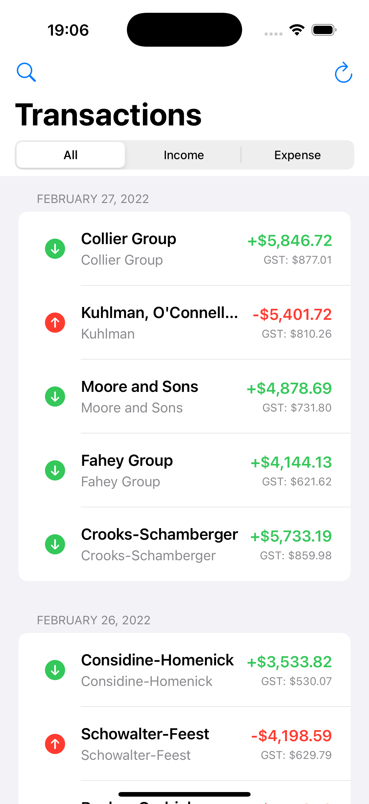
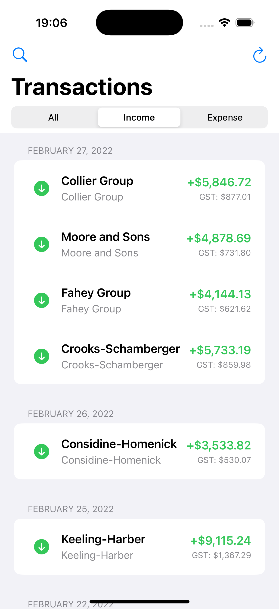
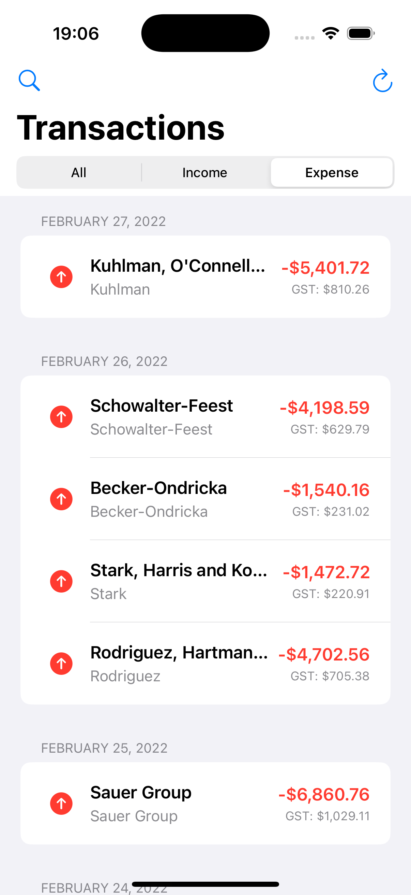
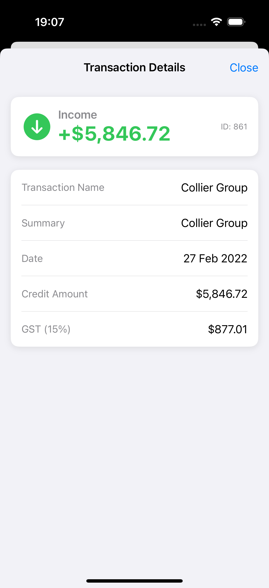
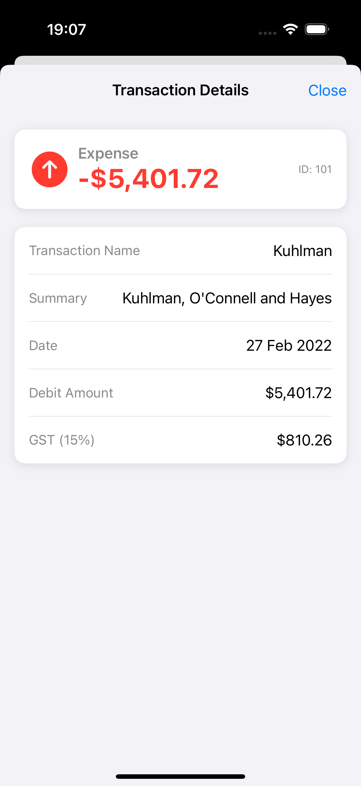
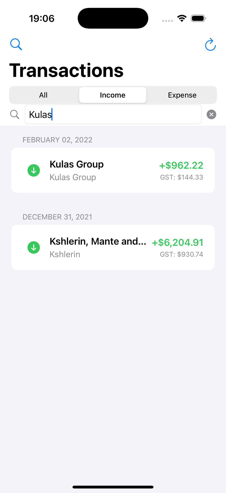
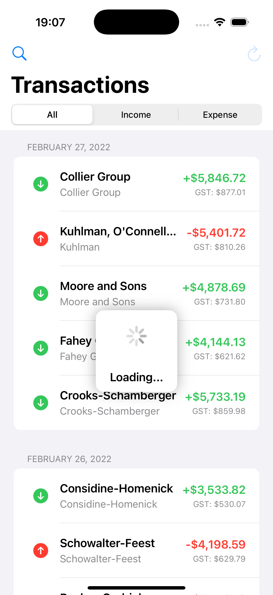

# Project Report

## 1. Project Overview and Requirements

The requirements and specifications were outlined in the [original README.md](README1.md)

## 2. How to Run and Test

### Running the Application

1. Clone the repository
2. Open `ASBInterviewExercise.xcodeproj` in Xcode 14.0 or later
3. Select an iOS simulator (iPhone 13 or newer recommended)
4. Build and run the application (⌘+R)

The application will load with mock transaction data for demonstration purposes.

### Running the Tests

#### Unit Tests
1. In Xcode, select the ASBInterviewExerciseTests scheme
2. Press ⌘+U to run all unit tests
3. View the test results in the Test Navigator (⌘+6)

Unit tests cover:
- Transaction model (property validation, type detection)
- Network service (data fetching, error handling)
- View model (filtering, sorting, data transformation)

#### UI Tests
1. In Xcode, select the ASBInterviewExerciseUITests scheme
2. Press ⌘+U to run all UI tests
3. The simulator will launch and automatically perform the test actions

UI tests cover:
- Basic app navigation
- Transaction list filtering
- Transaction detail view display
- Search functionality

## 3. Application Screenshots

Below are screenshots demonstrating the key features of the application:

### Transaction List View

The main transaction list shows all transactions grouped by date, with color-coded indicators for income (green) and expenses (red).



### Filtered Views

The application supports filtering by transaction type:

**Income Transactions Only:**



**Expense Transactions Only:**



### Transaction Details

Tapping on a transaction opens a detailed view:

**Income Transaction Details:**



**Expense Transaction Details:**



### Search Functionality

Users can search for specific transactions:



### Loading States

The app shows a loading indicator while fetching data:



## 4. Solution Implementation

### Architecture

I implemented a clean MVVM (Model-View-ViewModel) architecture with the following components:

- **Models**: Core data structures representing the domain
- **Views**: SwiftUI components responsible for rendering the UI
- **ViewModels**: Intermediary layers that handle business logic and transform data for views
- **Services**: Components that handle external data sources and operations

This architecture provides clear separation of concerns, improves testability, and simplifies maintenance.

### Directory Structure

```
ASBInterviewExercise/
├── Models/
│   └── Transaction.swift
├── Services/
│   └── NetworkService.swift
├── ViewModels/
│   └── TransactionViewModel.swift
├── Views/
│   ├── TransactionListView.swift
│   └── TransactionDetailView.swift
├── Utilities/
│   └── AppConfig.swift
```

### Implemented Features

1. **Transaction List**
   - Displays all transactions in a scrollable list
   - Supports filtering by transaction type (All, Income, Expense)
   - Implements search functionality
   - Supports pull-to-refresh

2. **Transaction Detail View**
   - Shows detailed information for a selected transaction
   - Displays transaction name, amount, date, and GST information
   - Supports closing/dismissing the view

3. **Integration with Existing Code**
   - Modified DIManager.swift to support dependency injection for new services
   - Updated SceneDelegate.swift to use SwiftUI as the main UI framework
   - Ensured compatibility with existing UIKit components

4. **Testing Support**
   - Implemented unit tests for models, services, and view models
   - Created UI tests for critical user flows
   - Added testing utilities and mock data

## 5. Challenge and Solutions

### UI Challenge

**Problems:**
1. When you load the app for the first time and click a transaction to enter the detailpage, the page is blank, and you need to exit and click the transaction again to enter the detailpage

Deep into the problem: This is becuase previous version is using a Bool state (showingDetail) and an optional (selectedTransaction) to control the same sheet at the same time causes a race condition - when you click it for the first time, SwiftUI marks showingDetail as true before unpacking selectedTransaction, so when the sheet pops up, the content is the nil branch of if let transaction = selectedTransaction { … }, and a blank page is displayed.


**Solutions:**
1. Get rid of the separate showingDetail boolean and only use selectedTransaction: Transaction? to control the sheet.
2. Change .sheet(isPresented: $showingDetail) to .sheet(item: $selectedTransaction) and SwiftUI will pop up when selectedTransaction becomes non-nil and pass the unwrapped object to you as content.

This approach significantly improved user experience and reliability of the app.

## 6. Conclusion

This project has been an exciting opportunity to demonstrate modern iOS development practices while solving real-world challenges. 

I would like to express my sincere gratitude to ASB for providing this opportunity to work on such an interesting project. This exercise has been both challenging and rewarding, allowing me to showcase my skills while learning new techniques. I appreciate the well-structured requirements and the freedom to implement creative solutions.

I look forward to any feedback and would be happy to discuss any aspects of my implementation in more detail. 
